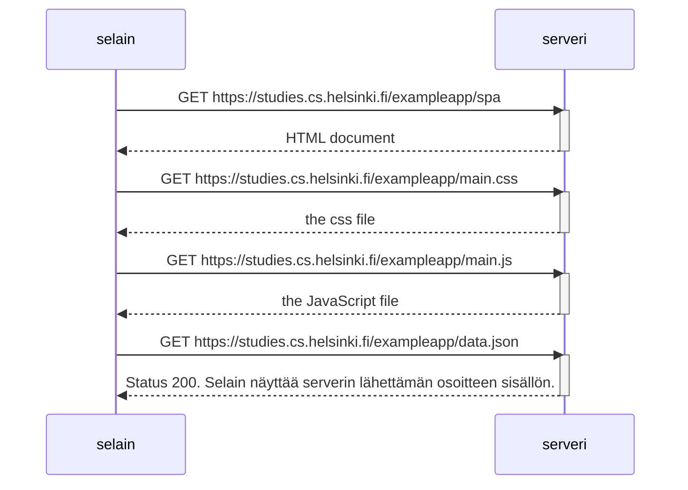

```mermaid

sequenceDiagram
    participant selain
    participant serveri
    
    selain->>serveri: GET https://studies.cs.helsinki.fi/exampleapp/spa
    activate serveri
    serveri-->>selain: HTML document
    deactivate serveri
    
    selain->>serveri: GET https://studies.cs.helsinki.fi/exampleapp/main.css
    activate serveri
    serveri-->>selain: the css file
    deactivate serveri
    
    selain->>serveri: GET https://studies.cs.helsinki.fi/exampleapp/main.js
    activate serveri
    serveri-->>selain: the JavaScript file
    deactivate serveri
    
    selain->>serveri: GET https://studies.cs.helsinki.fi/exampleapp/data.json
    activate serveri
    serveri-->>selain: Status 200. Selain näyttää serverin lähettämän osoitteen sisällön.
    deactivate serveri

```
