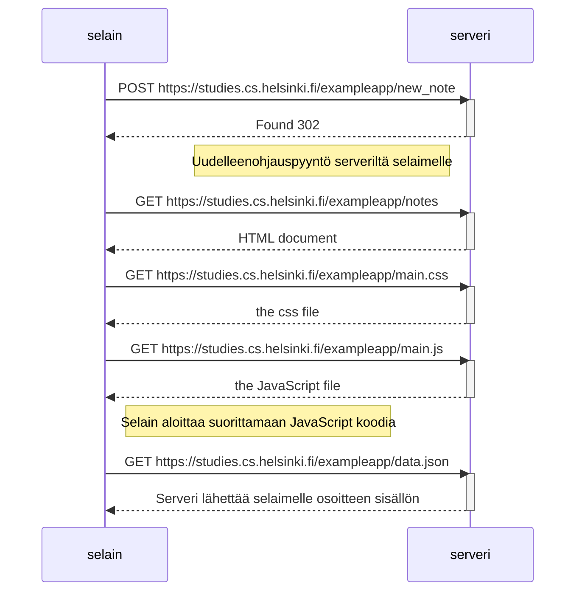

```mermaid
sequenceDiagram
    participant selain
    participant serveri

    selain->>serveri:POST https://studies.cs.helsinki.fi/exampleapp/new_note
    activate serveri
    serveri-->>selain: Found 302
    deactivate serveri

    Note left of serveri: Uudelleenohjauspyyntö serveriltä selaimelle
    
    selain->>serveri: GET https://studies.cs.helsinki.fi/exampleapp/notes
    activate serveri
    serveri-->>selain: HTML document
    deactivate serveri
    
    selain->>serveri: GET https://studies.cs.helsinki.fi/exampleapp/main.css
    activate serveri
    serveri-->>selain: the css file
    deactivate serveri
    
    selain->>serveri: GET https://studies.cs.helsinki.fi/exampleapp/main.js
    activate serveri
    serveri-->>selain: the JavaScript file
    deactivate serveri
    
    Note right of selain: Selain aloittaa suorittamaan JavaScript koodia
    
    selain->>serveri: GET https://studies.cs.helsinki.fi/exampleapp/data.json
    activate serveri
    serveri-->>selain: Serveri lähettää selaimelle osoitteen sisällön
    deactivate serveri    

    
```
