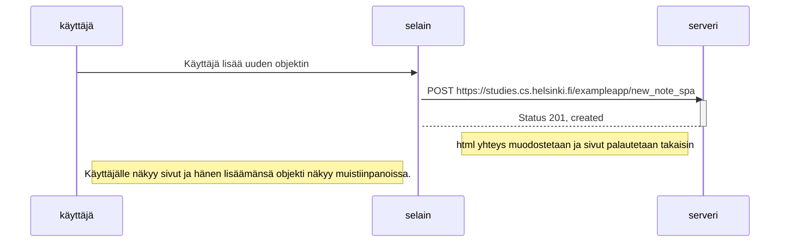

```mermaid

sequenceDiagram
  participant käyttäjä
  participant selain
  participant serveri

käyttäjä ->> selain: Käyttäjä lisää uuden objektin
activate selain
selain->>serveri: POST https://studies.cs.helsinki.fi/exampleapp/new_note_spa
activate serveri
serveri-->selain: Status 201, created
deactivate serveri

Note left of serveri: html yhteys muodostetaan ja sivut palautetaan takaisin

Note left of selain: Käyttäjälle näkyy sivut ja hänen lisäämänsä objekti näkyy muistiinpanoissa.

``` 
